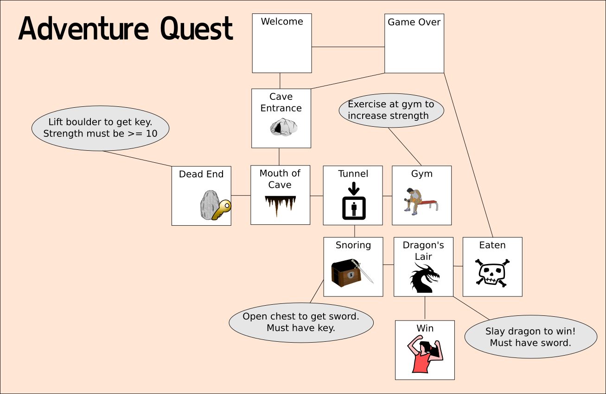

# Adventure Quest

Adventure Quest is a sample adventure for Bash Quest which takes the player on a short adventure to traverse a cave and slay a dragon.

## Game Map

## Puzzles

Adventure Quest has a single puzzle.

### Get the Sword

To complete Adventure Quest, the player must acquire a sword that can be used to slay the dragon. To get the sword, the player must obtain a key. To get the key, the player must lift a boulder. To lift the boulder, the player must lift weights in the gym.

## Tests

There is one test, `cave/tests/win` which when used will complete the entire game in 16 moves

## Known bugs

Currently, there are no known bugs
